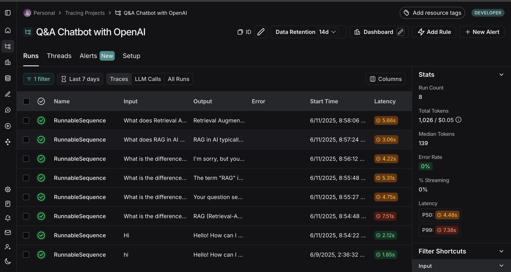

# Q-A_Chatbot_Application
End-to-End QA Chatbot using OpenAI

# 🤖 Q&A Chatbot using OpenAI, Streamlit & LangSmith

This is a powerful **Q&A chatbot** built using the **OpenAI API**, deployed with **Streamlit**, and monitored using **LangSmith**. The app allows users to ask natural language questions and get high-quality answers powered by GPT models.

---

## ✨ Features

- ✅ OpenAI-powered chatbot (GPT-4/GPT-4o/GPT-4-Turbo)
- ✅ Clean, interactive Streamlit interface
- ✅ LangChain-based prompt structuring
- ✅ Real-time tracing and observability with LangSmith

---

## 📦 Tech Stack

- [OpenAI API](https://platform.openai.com/)
- [Streamlit](https://streamlit.io/)
- [LangChain](https://www.langchain.com/)
- [LangSmith](https://smith.langchain.com/)
- Python 3.11

---

Clone it:
1. Enter your LangChain API for tracing.
2. Install the requirements.txt (pip install -r requirements.txt)
3. Run the streamlit application (streamlit run app.py)

How to use?

1. First create your OpenAI API key (if you don't have).
2. Clone the repo.
3. Create a virtual enviroment (python -m venv env_name).
4. Install all the requirments present in the requirments.txt (pip install -r requirments.txt).
5. Run the Streamlit application (streamlit run app.py).
7. A new streamlit application opens.

9. Insert your OpenAI key. Customize the temperature (The uniquen answer of the same question), choose your favirote model (GPT-4/GPT-4o/GPT-4-Turbo).
10. Enter the Question
11. ChatOpenAI calls OpenAI’s API to generate an answer.
12. LangSmith logs the full trace (inputs, outputs, model config).

The result is displayed in Streamlit.

